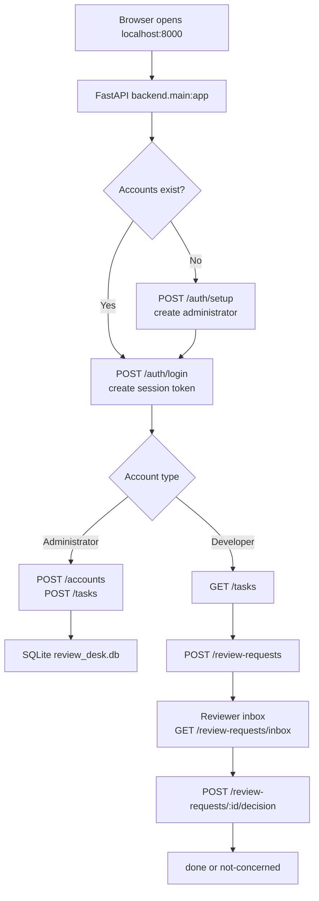

# Review Desk Python workflow

## Python entry points

- `backend/main.py`: FastAPI application, authentication, permissions, persistence, and review endpoints.
- `frontend/index.html`: application shell.
- `frontend/app.js`: browser interactions and API calls.
- `frontend/styles.css`: application presentation.
- `backend/review_desk.db`: local SQLite database created at runtime.
